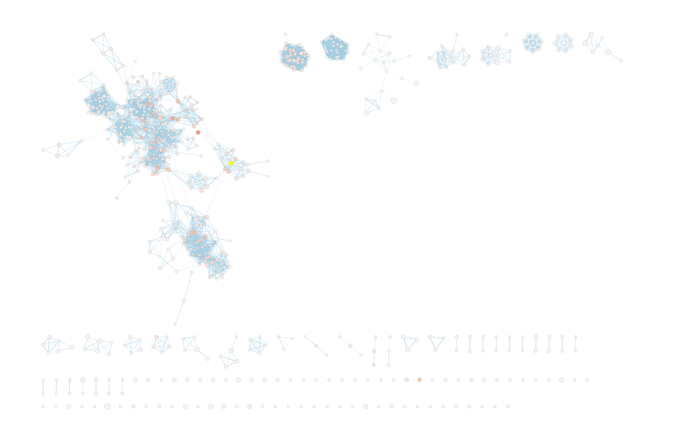
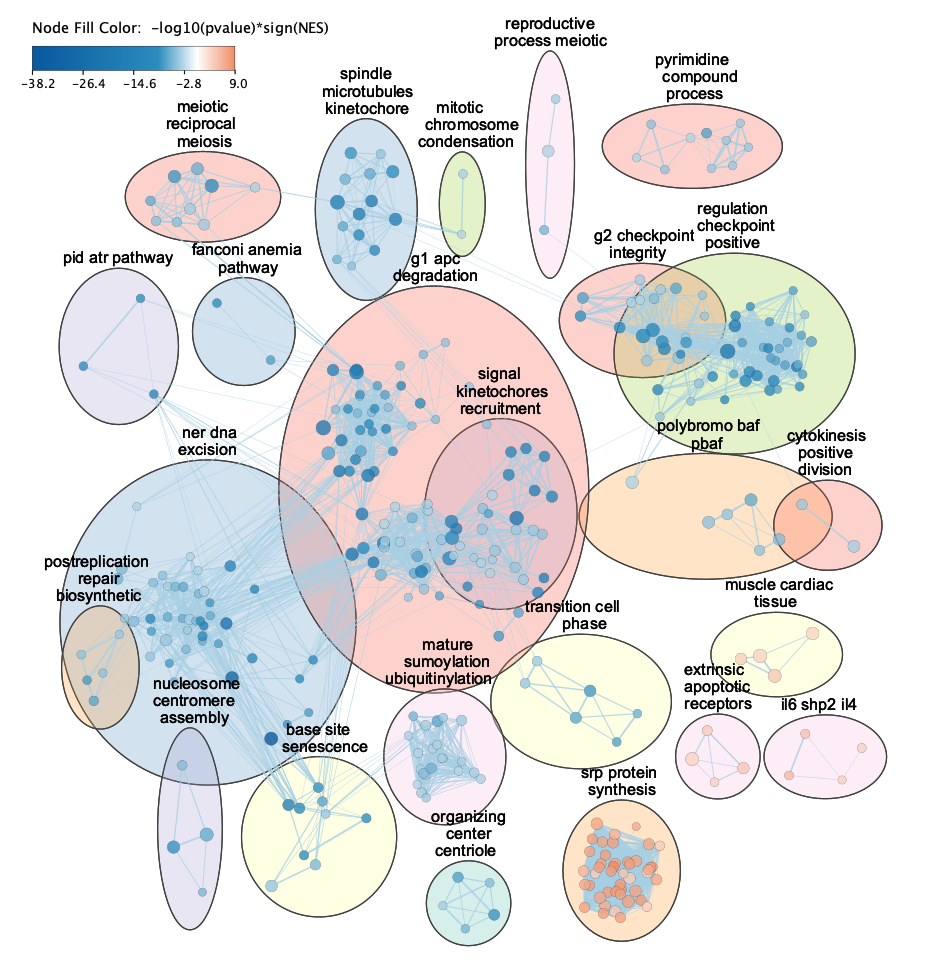
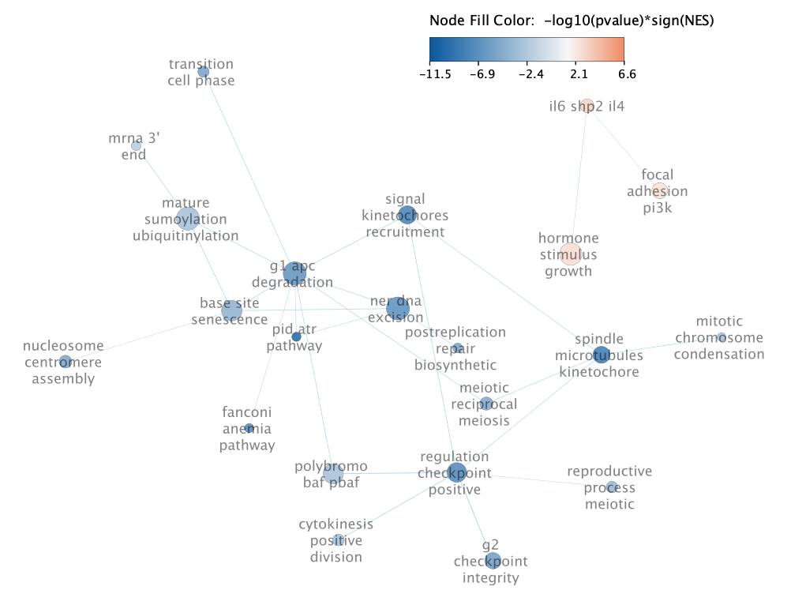
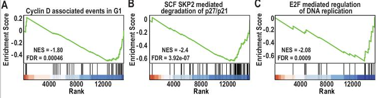

```{r, message=FALSE, warning=FALSE}
# Necessary code to run this portion of Assignment 2 as a standalone R script
# Copied from A1 when necessary

library(GEOquery)
library(rmarkdown)
library(readr)
library(dplyr)

curr_gse <- "GSE253362"

# making sure that I do not download a new file every time I rerun this notebook
raw_counts_file = "data/GSE253362/GSE253362_rawcounts_mubritinib.tsv"
if (!file.exists(raw_counts_file)) {
  source("./fetch_geo_supp.R")
  GEOquery::fetch_geo_supp(gse = curr_gse)
  path <- file.path("data",curr_gse)
  files <- list.files(path, pattern = params$file_grep, 
                      full.names = TRUE, recursive = TRUE)
  raw_counts_file <- sub("\\.gz$", "", files[1])
  # remove the .gz because the data downloaded is not compressed even though it 
  # pretends to be... Not sure why, probably an error with the data upload on 
  # the author's end
  file.rename(files, raw_counts_file)
}

raw_counts_data <- readr::read_tsv(raw_counts_file, show_col_types = FALSE)

library(biomaRt)
# Function from lecture that strips ensembl version numbers from the id
strip_ensembl_version <- function(x) sub("\\..*$", "", x)

# Force the underlying data as a vector, not a dataframe.
ids <- raw_counts_data[["ensembl_id"]]
ensembl_ids <- unique(strip_ensembl_version(ids))
raw_counts_data$ensembl_id_trimmed <- strip_ensembl_version(ids)

# Cache gene map so the code is not as reliant on ensembl connection
cached_map <- "cached_map.rds"
if (file.exists(cached_map)) {
  gene_map <- readRDS(cached_map)
} else {
  # Pull gene map for all ensembl ids from ensembl homo sapiens dataset
  ensembl <- biomaRt::useMart("ensembl", dataset = "hsapiens_gene_ensembl")
  gene_map <- biomaRt::getBM(
    attributes = c("ensembl_gene_id", "hgnc_symbol"),
    filters = "ensembl_gene_id",
    values = ensembl_ids,
    mart = ensembl
  )
  saveRDS(gene_map, cached_map)
}

unmapped_genes = gene_map[gene_map$hgnc_symbol == "",]

# Get the details of all these ensembl ids. Cache the results
# as to not rely always on ensembl connection
cached_map <- "cached_ensg_details.rds"
if (file.exists(cached_map)) {
  ensg_details <- readRDS(cached_map)
} else {
  ensembl <- biomaRt::useMart("ensembl", dataset = "hsapiens_gene_ensembl")
  ensg_details <- biomaRt::getBM(
    attributes = c(
      "ensembl_gene_id",
      "gene_biotype"
    ),
    filters = "ensembl_gene_id",
    values  = unmapped_genes,
    mart    = ensembl
  )
  saveRDS(ensg_details, cached_map)
}

gene_map <- gene_map[gene_map$hgnc_symbol != "",]

# Get the number of unique hgnc per ensembl
dup_ensembl <- ave(
  gene_map$hgnc_symbol,
  gene_map$ensembl_gene_id,
  FUN = function(x) length(unique(x))
)

# subset rows where an Ensembl ID maps to >1 HGNC symbol
gene_map_multi <- gene_map[dup_ensembl > 1, ]

gene_map <- gene_map[gene_map$hgnc_symbol != "LINC00856",]

# Combine the mappings with raw counts
mapped_counts_data <- raw_counts_data %>% dplyr::left_join(gene_map, 
                                by = join_by("ensembl_id_trimmed" == 
                                               "ensembl_gene_id"))

# For all the genes with an hgnc, combine the rows with the same hgnc symbol
mapped_counts_data <- mapped_counts_data %>% 
  dplyr::filter(!is.na(hgnc_symbol)) %>% 
  dplyr::select(-ensembl_id_trimmed, -ensembl_id) %>% 
  dplyr::group_by(hgnc_symbol) %>% 
  dplyr::summarise(dplyr::across(where(is.numeric), sum), .groups = "drop")

library(edgeR)

# Reshift gene id column to rownames
gene_ids <- mapped_counts_data[1]
mapped_counts_data <- mapped_counts_data[-1]
rownames(mapped_counts_data) <- gene_ids$hgnc_symbol

groups <- sub("-.$", "", colnames(mapped_counts_data))

# Using DGEList to represent my data
DGE_data <- edgeR::DGEList(mapped_counts_data, 
                           group = groups, 
                           genes = gene_ids$hgnc_symbol)

keep <- edgeR::filterByExpr(DGE_data,
                            min.count = 10, 
                            min.total.count = 350)
DGE_data <- DGE_data[keep, ]

library(tidyr)
# Using TMM norm factors from edgeR for normalization
DGE_data <- edgeR::calcNormFactors(DGE_data, method = "TMM")
# Normalize on reads using cpm, non logged
norm_cpm <- edgeR::cpm(DGE_data, log = FALSE, prior.count = 1)


disp <- edgeR::estimateDisp(DGE_data)
fit <- edgeR::glmQLFit(disp)
qlf <- edgeR::glmQLFTest(fit)


qlf_table <- edgeR::topTags(qlf, n = Inf)$table 
pass_fdr_df <- qlf_table %>%
  mutate(sig = FDR < 0.05)

```


```{r, message=FALSE, warning=FALSE}
library(rmarkdown)
display_table <- function(dataframe, colnames) {
  copy_dataframe <- dataframe
  colnames(copy_dataframe) <- colnames
  rownames(copy_dataframe) <- NULL
  rmarkdown::paged_table(copy_dataframe)
}


```

# 1. Introduction 

The chosen study was testing the effects of mubritinib on Glioblastomas,
one of the most treatment-resistant cancers [@Burban2025]. Mubritinib is a new
drug candidate and this study elucidates its effects on the body, one of the 
areas of study was through an RNA-seq analysis to find gene differential expressions.

The RNA-seq data was downloaded from GEO with id `GSE253362`. They had three 
control conditions and three test conditions on human derived self-renewing brain 
tumour stem cells (BTSCs).

Initial analysis in the first step of this assignment pre-processed the data 
through filtering, cleaning, and mapping the data to HUGO gene identifiers. The 
counts were normalized and differential expression was performed using
`edger`'s `glm QLF` methods. 

Of the `15924` genes, `5160` were differentially expressed signficantly (under 
FDR); `2510` genes were upregulated and `2650` genes were downregulated


# 2. Thresholded Over-representation Analysis

Thresholded over-representation analysis (ORA) was performed using g:profiler.

G:profiler [@Kolberg2023-bl] is a web system developed by the ELIXIR Estonia research institute.
Published in 2007, the original paper has 1750 citations. Its subsequent updates 
in 2019 and 2023 has 5663 and 1470 citations respectively. This tool is widely
used in research and therefore a capable system to analyze my gene sets.
Its web interface is simple and intuitive to understand, it has an associated
r package to script my queries, and its results are inputtable into cytoscape.
Ultimately, these all make g:profiler the method of choice for thresholded
over-representation analysis (ORA). 

I used g:profiler web last updated on Jun 15, 2025 and the `gprofiler2` R package
version `0.2.4` [@gprofiler2].


I ran g:profiler with three main datasets:

- GO Biological pathways (BP) from BioMart; releases/2025-03-16

- Reactome from BioMart; 2025-05-23

- Wikipathways from 2025-05-10

These were chosen because of their importance to the problem; focusing on biological pathways.
As well, they each provide a diversity in annotation depth or breadth. GO BP is 
wide with many annotations, but Wikipathways is smaller. GO BP can therefore provide
an overarching vision of the gene sets that are over-represented, but Reactome and
Wikipathways can provide smaller level, detailed, pathways that might be more 
specific to the problem at hand.

Each run was performed with these g:profiler parameters:

- Organism: Human

- Highlight driver terms in GO: True

- Significance threshold: Benjamini-Hochberg FDR

- Data sources: see above

All other parameters were kept as defaults.

## 2.1 ORA with all differentially expressed genes
```{r, message=FALSE, warning=FALSE}
library(gprofiler2)
# Taking the differential expression data and separating them by up/down regulation. Saving
# the files for trial running ORA on web servers.
thresholded_genes <- (pass_fdr_df %>% filter(FDR < 0.05) %>% head(300))["genes"]
thresholded_genes_up <- (pass_fdr_df %>% filter(FDR < 0.05) %>% filter(logFC > 0) %>% head(300))["genes"]
thresholded_genes_down <- (pass_fdr_df %>% filter(FDR < 0.05) %>% filter(logFC < 0) %>% head(300))["genes"]
# Ranked list is important for GSEA
ranked_list <- pass_fdr_df[order(pass_fdr_df$logFC, decreasing=TRUE),][c("genes", "logFC")]

# Writing data for potential work outside of the script.
write_csv(thresholded_genes, file="data/thresholded_gene_list.csv",
          col_names=FALSE)
write_csv(thresholded_genes_up, file="data/thresholded_gene_list_up.csv",
          col_names=FALSE)
write_csv(thresholded_genes_down, file="data/thresholded_gene_list_down.csv",
          col_names=FALSE)
write_delim(ranked_list, 
          file="data/ranked_list.txt", col_names=FALSE, delim="\t")

# Obtain the gprofiler results from query
gostres <- gprofiler2::gost(query = thresholded_genes$genes, 
                organism = "hsapiens", ordered_query = FALSE, 
                multi_query = FALSE, significant = TRUE, exclude_iea = TRUE, 
                measure_underrepresentation = FALSE, evcodes = FALSE, 
                user_threshold = 0.05, correction_method = "fdr", 
                domain_scope = "annotated", custom_bg = NULL, 
                numeric_ns = "", sources = c("GO:BP", "REAC", "WP"), 
                as_short_link = FALSE, highlight = TRUE)

```


The first test was to run g:profiler on the top 300 differentially expressed genes.
From this, there were `591` genesets that were significantly
enriched from the three datasets, without any thresholding. 

Subsetting to GO biological pathways (GOBP), there were `405` gene sets significantly enriched.
Looking at the top 10 in **Table 1**, there is evidently a lot of very large and 
very broad gene sets that provide little information, like "cell cycle". It is important
to make sure that these are not biasing the result.


```{r, message=FALSE, warning=FALSE}
# Set parameters for how many gene sets to display in all the tables
num_gene_sets = 10 # for display
term_size_min = 5
term_size_max = 350

# Filtering for GO results 
GO_BP_res <- gostres$result %>% dplyr::filter(source == "GO:BP") %>% dplyr::arrange(p_value) %>% 
  dplyr::filter(significant == TRUE) %>% 
  dplyr::select(term_name, p_value, term_size, intersection_size)

# Displaying the top GO results by p-value
display_table(GO_BP_res[1:num_gene_sets,], 
              c("Name", "P-value", "Term Size", "Intersection Size"))

```

**Table 1.** Top ten gene sets in the GO biological pathways
dataset sorted by p-value, calculated in over representation analysis
of all differentiated genes using g:profiler. 
This was with no threshold to gene set term size.


Therefore, we thresholded to gene sets larger than 5 and smaller than 350, only `281`
were significantly enriched under GOBP. Therefore in **Table 2**, we see the top
ten gene sets enriched. Interestingly, we see a lot of terms related to
mitosis, dna replication, cell cycle, etc. 

```{r, message=FALSE, warning=FALSE}
# Filtering GO results by term size
GO_BP_term_filter_res <- GO_BP_res %>% dplyr::filter(term_size >= term_size_min,
                                                     term_size <= term_size_max)

# Displaying the top GO results by p-value after filtering
display_table(GO_BP_term_filter_res[1:num_gene_sets,], 
              c("Name", "P-value", "Term Size", "Intersection Size"))

```


**Table 2.** Top ten gene sets in the GO biological pathways
dataset sorted by p-value, calculated in over representation analysis 
of all differentiated genes using g:profiler. 
Gene sets were thresholded to be between 15 - 350 (inclusive) genes.


Subsetting to Reactome, there were `147` gene sets significantly enriched. In 
**Table 3**, we see the top 10 based on p-value. As with
GOBP, we see a lot of cell cycle and mitosis related gene sets, however these are not
filtered for size. 

```{r, message=FALSE, warning=FALSE}
# Filtering the results for Reactome
REAC_res <- gostres$result %>% dplyr::filter(source == "REAC") %>% dplyr::arrange(p_value) %>% 
  dplyr::filter(significant == TRUE) %>% 
  dplyr::select(term_name, p_value, term_size, intersection_size)

# Displaying the top REAC results by p-value
display_table(REAC_res[1:num_gene_sets,], 
              c("Name", "P-value", "Term Size", "Intersection Size"))

```

**Table 3.** Top ten gene sets in the Reactome
dataset sorted by -log10(pval), calculated in over representation analysis 
of all differentiated genes using g:profiler. 
This was with no threshold to gene set term size.


After thresholding to gene sets larger than 15 and smaller than 350, `136`
were significantly enriched under Reactome, only a small change. As seen in **Table 4**, 
The general theme remains the same, cell cycle and mitosis.

```{r, message=FALSE, warning=FALSE}
# Filtering REAC results by term size
REAC_term_filter_res <- REAC_res %>% dplyr::filter(term_size >= term_size_min,
                                                     term_size <= term_size_max)
# Displaying the top REAC results by p-value after term filtering
display_table(REAC_term_filter_res[1:num_gene_sets,], 
              c("Name", "P-value", "Term Size", "Intersection Size"))

```

**Table 4.** Top ten gene sets in the Reactome
dataset sorted by -log10(pval), calculated in over representation analysis 
of all differentiated genes using g:profiler. 
Gene sets were thresholded to be between 5 - 350 (inclusive) genes.


Wikipathways has much smaller gene sets, so thresholding
was done immediately. After thresholding to gene sets larger than 5 and smaller than 350, only `39`
were significantly enriched under Wikipathways (see **Table 5**). We see the first reference
towards cancer in the term "Retinoblastoma gene in cancer", but again, a lot of cell cycle related terms.


```{r, message=FALSE, warning=FALSE}
# Filtering the results for Wikipathways
WP_res <- gostres$result %>% dplyr::filter(source == "WP") %>% dplyr::arrange(p_value) %>% 
  dplyr::filter(significant == TRUE) %>% 
  dplyr::select(term_name, p_value, term_size, intersection_size) %>% 
  dplyr::filter(term_size >= term_size_min,
                term_size <= term_size_max)

# Displaying the top Wikipathways results by p-value
display_table(WP_res[1:num_gene_sets,], 
              c("Name", "P-value", "Term Size", "Intersection Size"))

```

**Table 5.** Top ten gene sets in the Wikipathways
dataset sorted by -log10(pval), calculated in over representation analysis 
of all differentiated genes using g:profiler. 
Gene sets were thresholded to be between 5 - 350 (inclusive) genes.


## 2.2 ORA with up-regulated genes

A lot of the enriched gene sets was related to cell cycle. But does this mean the 
cell cycle was upregulated, downregulated, or both? To test this, we subset the 
differentially expressed genes to only those that were upregulated from control to
test samples.

The same test was run, however, thresholding was consistent to restrict their size to be from
5-350 inclusive.

Overall, `660` gene sets were enriched from up-regulated genes.

To explore this, we first look at GOBP again. There were `347` gene sets enriched
after thresholding. The top 10 now have no indication of cell cycle related gene sets!
Now the gene sets are more related to amino acids and apotosis!

```{r, message=FALSE, warning=FALSE}
# Obtain the gprofiler results from query
gostres_up <- gprofiler2::gost(query = thresholded_genes_up$genes, 
                organism = "hsapiens", ordered_query = FALSE, 
                multi_query = FALSE, significant = TRUE, exclude_iea = TRUE, 
                measure_underrepresentation = FALSE, evcodes = FALSE, 
                user_threshold = 0.05, correction_method = "fdr", 
                domain_scope = "annotated", custom_bg = NULL, 
                numeric_ns = "", sources = c("GO:BP", "REAC", "WP"), 
                as_short_link = FALSE, highlight = TRUE)


# Filtering for GO results. Auto filtering for term size
GO_BP_res_up <- gostres_up$result %>% dplyr::filter(source == "GO:BP") %>% dplyr::arrange(p_value) %>% 
  dplyr::filter(significant == TRUE) %>% 
  dplyr::select(term_name, p_value, term_size, intersection_size) %>% 
  dplyr::filter(term_size >= term_size_min,
                term_size <= term_size_max)

# Displaying the top GO results by p-value
display_table(GO_BP_res_up[1:num_gene_sets,], 
              c("Name", "P-value", "Term Size", "Intersection Size"))

```

**Table 6.** Top ten gene sets in the GO biological pathways
dataset sorted by -log10(pval), calculated in over representation analysis 
of only up-regulated genes using g:profiler. 
Gene sets were thresholded to be between 5 - 350 (inclusive) genes.


Continuing on, we explore Reactome and Wikipathways in the same way. Reactome has
similar results to GOBP, more related to proteins/translation and amino acids (see **Table 7**).
Wikipathways provided similar ideas related to proteins (see **Table 8**).

```{r, message=FALSE, warning=FALSE}
# Filtering for REAC results. Auto filtering for term size
REAC_res_up <- gostres_up$result %>% dplyr::filter(source == "REAC") %>% dplyr::arrange(p_value) %>% 
  dplyr::filter(significant == TRUE) %>% 
  dplyr::select(term_name, p_value, term_size, intersection_size) %>% 
  dplyr::filter(term_size >= term_size_min,
                term_size <= term_size_max)

# Displaying the top REAC results by p-value
display_table(REAC_res_up[1:num_gene_sets,], 
              c("Name", "P-value", "Term Size", "Intersection Size"))

```


**Table 7.** Top ten gene sets in the Reactome
dataset sorted by -log10(pval), calculated in over representation analysis 
of only up-regulated genes using g:profiler. 
Gene sets were thresholded to be between 5 - 350 (inclusive) genes.

```{r, message=FALSE, warning=FALSE}
# Filtering for Wikipathways results. Auto filtering for term size
WP_res_up <- gostres_up$result %>% dplyr::filter(source == "WP") %>% dplyr::arrange(p_value) %>% 
  dplyr::filter(significant == TRUE) %>% 
  dplyr::select(term_name, p_value, term_size, intersection_size) %>% 
  dplyr::filter(term_size >= term_size_min,
                term_size <= term_size_max)

# Displaying the top Wikipathways results by p-value
display_table(WP_res_up[1:num_gene_sets,], 
              c("Name", "P-value", "Term Size", "Intersection Size"))

```

**Table 8.** Top ten gene sets in the Wikipathways
dataset sorted by -log10(pval), calculated in over representation analysis 
of only up-regulated genes using g:profiler. 
Gene sets were thresholded to be between 5 - 350 (inclusive) genes.

## 2.3 ORA with down-regulated genes

If the cell cycle enrichment did not appear in the up-regulated gene enrichment, it should appear
in the down-regulated gene enrichment. 

ORA with down-regulated genes had `620` gene sets enriched. Filtering to GOBP and 
thresholding, `305` gene sets were still enriched. `169` gene sets were
enriched in Reactome and `35` gene sets were enriched in Wikipathways.
This is significantly more than the up-regulated genes. As well, GOBP and Reactome 
(seen in **Table 9** and **Table 10**) had their top ten enriched gene sets all
related to the cell cycle / mitosis / DNA replication.

```{r, message=FALSE, warning=FALSE}
# Obtain the gprofiler results from query
gostres_down <- gprofiler2::gost(query = thresholded_genes_down$genes, 
                organism = "hsapiens", ordered_query = FALSE, 
                multi_query = FALSE, significant = TRUE, exclude_iea = TRUE, 
                measure_underrepresentation = FALSE, evcodes = FALSE, 
                user_threshold = 0.05, correction_method = "fdr", 
                domain_scope = "annotated", custom_bg = NULL, 
                numeric_ns = "", sources = c("GO:BP", "REAC", "WP"), 
                as_short_link = FALSE, highlight = TRUE)


# Filtering for GO results. Auto filtering for term size
GO_BP_res_down <- gostres_down$result %>% dplyr::filter(source == "GO:BP") %>% dplyr::arrange(p_value) %>% 
  dplyr::filter(significant == TRUE) %>% 
  dplyr::select(term_name, p_value, term_size, intersection_size) %>% 
  dplyr::filter(term_size >= term_size_min,
                term_size <= term_size_max)

# Displaying the top GO results by p-value
display_table(GO_BP_res_down[1:num_gene_sets,], 
              c("Name", "P-value", "Term Size", "Intersection Size"))

```

**Table 9.** Top ten gene sets in the GO biological pathways
dataset sorted by -log10(pval), calculated in over representation analysis 
of only down-regulated genes using g:profiler. 
Gene sets were thresholded to be between 5 - 350 (inclusive) genes.

```{r, message=FALSE, warning=FALSE}
# Filtering for Reactome results. Auto filtering for term size
REAC_res_down <- gostres_down$result %>% dplyr::filter(source == "REAC") %>% dplyr::arrange(p_value) %>% 
  dplyr::filter(significant == TRUE) %>% 
  dplyr::select(term_name, p_value, term_size, intersection_size) %>% 
  dplyr::filter(term_size >= term_size_min,
                term_size <= term_size_max)

# Displaying the top Reactome results by p-value
display_table(REAC_res_down[1:num_gene_sets,], 
              c("Name", "P-value", "Term Size", "Intersection Size"))

```

**Table 10.** Top ten gene sets in the Reactome
dataset sorted by -log10(pval), calculated in over representation analysis 
of only down-regulated genes using g:profiler. 
Gene sets were thresholded to be between 5 - 350 (inclusive) genes.

```{r, message=FALSE, warning=FALSE}
# Filtering for Wikipathways results. Auto filtering for term size
WP_res_down <- gostres_down$result %>% dplyr::filter(source == "WP") %>% dplyr::arrange(p_value) %>% 
  dplyr::filter(significant == TRUE) %>% 
  dplyr::select(term_name, p_value, term_size, intersection_size) %>% 
  dplyr::filter(term_size >= term_size_min,
                term_size <= term_size_max)

# Displaying the top Wikipathways results by p-value
display_table(WP_res_down[1:num_gene_sets,], 
              c("Name", "P-value", "Term Size", "Intersection Size"))

```

**Table 11.** Top ten gene sets in the Wikipathways
dataset sorted by -log10(pval), calculated in over representation analysis 
of only down-regulated genes using g:profiler. 
Gene sets were thresholded to be between 5 - 350 (inclusive) genes.


## 2.4 Interpretation

Overall, we see a clear divide between the up-regulated gene set, down-regulated
gene set, and the combination of the both. The combination has a lot of signal into
cell-cycle related gene sets, with some variety. However, that variety disappears in the
down-regulated analysis where almost all of the top enriched genes are cell cycle related.
Whereas cell cycle related gene sets disappears in the up-regulated
analysis. Ultimately, this shows the clear biological signal of the difference between what is up-regulated
and down-regulated.

The original paper [@Burban2025] discussed two main pathways: it impairs the 
AMPK/p27 pathway and deregulates the cell cycle. I can clearly validate the idea
of deregulation of the cell cycle, as there is an overwhelming signal
that it is down-regulated through the 
enrichment with the down-regulated gene set analysis. 

The down-regulation of the AMPK/p27 pathway is a little harder to verify. The paper
claims that these pathways are down-regulated: including cyclin D1-associated events in G1, 
SCF SKP2-mediated degradation of p27/p21 and E2F-mediated regulation of DNA replication. None
of these appeared clearly in the top hits of the thresholded analysis. 

After some searching: I found `E2F-mediated regulation of DNA replication` was a
reactome pathway downregulated with a p-value of 5.58e-08 and `SCF SKP2-mediated degradation of p27/p21`
was a reactome pathway downregulated with a p-value of 0.024.

Though these were clear signs that something is biologically happening here, 
it was not convincing enough proof to say the paper was right, and mubritinib
affects the AMPK/p27 pathway.


```{r, warning=FALSE, message=FALSE}
# exploring the datasets for pathways that match the paper.
GO_related_e2f <- grep("E2F", GO_BP_res_down$term_name) # empty
reac_related_e2f <- grep("E2F", REAC_res_down$term_name)
GO_related_p27 <- grep("p27", GO_BP_res_down$term_name) # empty
reac_related_p27 <-grep("p27", REAC_res_down$term_name)
reac_related_D1 <-grep("D1", REAC_res_down$term_name) # empty


res_e2f <- REAC_res_down[reac_related_e2f, ]
res_p27 <- REAC_res_down[reac_related_p27, ]

```


### TODO WRITE PUBLICATED EVIDENCE FOR WHAT IS GOING ON

# 3. Non-thresholded Gene Set Enrichment Analysis (GSEA)

Thresholded gene set analysis provided a lot of insight, but signal could have 
been lost through the removal of gene that are not significantly differentially
expressed. Some drug effects may not be seen in large changes but many small changes.

I perform non-thresholded GSEA with `fgsea` [@fgsea], a fast GSEA alternative that is
run entirely in R. I chose this because it closely models after the original GSEA[@Subramanian2005-vw],
providing the data necessary to create plots on the leading edge. The original
GSEA is an industry standard, cited `57039` times. However,
`fgsea` is much faster and much easier to use as it is not in a separate java 
application.

`fgsea` R package was run on version `1.34.2`.

This run was conducted on the Bader's lab's curated gene sets `.gmt` file, specifically
with these parameters:

- Organism: Human

- GO Biological Pathways

- All pathways

- No PFOCR

- No GO IEA

- September 1, 2025


## 3.1 Exploration of Individual Gene Set Enrichment 


```{r, message=FALSE, warning=FALSE, include=FALSE}
library(fgsea)
library(ggplot2)
library(GSA)

# Plot fgsea function
plot_fgsea <- function(name, title, pathways_data, fgsea_format_ranks, gsea_res,
                       y_val) {
  fgsea::plotEnrichment(pathways_data[[name]],
               fgsea_format_ranks) + ggplot2::labs(title=title) + 
  annotate("text", 
           x = 0, # Left side
           y = y_val, # Bottom (adjust based on ES range)
           label = paste0("NES: ", round(gsea_res[pathway==name]$NES, 2), "\n", "FDR: ", 
                          formatC(gsea_res[pathway==name]$padj, format = "e", digits = 2)),
           hjust = 0, vjust = 0, size = 4)
}

# Run fgsea with pathway and ranks
bader_gmt_file_path <- "data/Human_GOBP_AllPathways_noPFOCR_no_GO_iea_September_01_2025_symbol.gmt"
pathways_data <- fgsea::gmtPathways(bader_gmt_file_path)
fgsea_format_ranks <- setNames(ranked_list[["logFC"]], ranked_list[["genes"]])
gsea_res <- fgsea::fgsea(pathways_data, 
                         fgsea_format_ranks,
                         maxSize = term_size_max, minSize = term_size_min)

gmt_data <- GSA::GSA.read.gmt(bader_gmt_file_path)
# Write out results and other data to later put into cytoscape.
# Required for enrichment map analysis
write_delim(gsea_res[,c("pathway", "size", "pval", "padj", "ES", "NES", "log2err", "leadingEdge")], delim="\t", file="data/gsea_res.tsv")

export_norm_cpm <- as.data.frame(norm_cpm) 
export_norm_cpm <- tibble::rownames_to_column(export_norm_cpm, "name") %>% 
  mutate(description = name) %>%
  relocate(description, .after = name)
write_delim(export_norm_cpm, file="data/normalized_rnaseq.txt", delim="\t")

write_delim(gsea_res[order(gsea_res$pval)] %>% filter(NES > 0), 
            delim="\t",
            file="data/gsea_report_pos.tsv")

write_delim(gsea_res[order(gsea_res$pval)] %>% filter(NES < 0), 
            delim="\t",
            file="data/gsea_report_neg.tsv")
```

#### Top Pathway Enrichment Scores
```{r, message=FALSE, warning=FALSE}
# Add desscription column to gsea results so that resulting plots can use the description instead
# of the pathway name
name_mapping = data.frame(pathway=gmt_data$geneset.names, description=gmt_data$geneset.descriptions)
pathways_data_renamed <- pathways_data
names(pathways_data_renamed) <- gmt_data$geneset.descriptions
gsea_res_reordered <- gsea_res %>% dplyr::left_join(name_mapping, by="pathway") %>% 
  dplyr::rename(pathway_old = pathway, pathway = description) %>% 
  dplyr::relocate("pathway", .before="pathway_old") %>% 
  dplyr::relocate("pathway_old", .after="leadingEdge")

# Rename some names that are too long for display
old_name <- "Response of EIF2AK4 (GCN2) to amino acid deficiency"
new_name <- "Response to amino acid deficiency"
names(pathways_data_renamed)[names(pathways_data_renamed) == old_name] <- new_name
gsea_res_reordered$pathway[gsea_res_reordered$pathway == old_name] <- new_name

topPathwaysUp <- gsea_res_reordered[ES > 0][head(order(pval), n=10), pathway]
topPathwaysDown <- gsea_res_reordered[ES < 0][head(order(pval), n=10), pathway]
topPathways <- c(topPathwaysUp, rev(topPathwaysDown))
fgsea::plotGseaTable(pathways_data_renamed[topPathways], 
                     fgsea_format_ranks, 
                     gsea_res_reordered, 
                     gseaParam=0.5,
                     headerLabelStyle = list(size=12, fontface="bold"),
                     colwidths = c(6, 3, 0.8, 1.2, 1.2))
```

**Figure 1.** The top ten enriched pathways for each 
up-regulated and down-regulated categories are shown. Top ten is determined by
lowest p-value. Their pathway names, normalized enrichment score (NES), pvalues, 
and adjusted pvalues (FDR correction) are shown. Gene ranks shows a condensed enrichment
plot that shows what genes contributed to the pathway enrichment.


The top ten up-regulated and down-regulated gene sets hold very clear patterns. 
Seven of the top ten gene sets that were upregulated were related to protein synthesis. Obviously,
these are all gene sets that are closely related, and one being enriched causes many of the others
to be enriched as well. However, we also see amino acid deficiency and starvation pathways, 
a related, but different idea.

The down-regulated genes continue to have a lot to do with the cell cycle. Mitosis,
cell cycle checkpoints, and DNA replication are all among the top ten. The most 
enriched set with a negative NES related to E2F targets, however, E2F is a clear 
actor in cell cycle, integrating cell cycle progression with DNA repair [@Ren2002-ts].


```{r, message=FALSE, warning=FALSE}
fgsea::plotEnrichment(pathways_data[["HALLMARK_E2F_TARGETS%MSIGDBHALLMARK%HALLMARK_E2F_TARGETS"]],
               fgsea_format_ranks) + ggplot2::labs(title="E2F Targets Gene Set Enrichment")
```

**Figure 2.** The GSEA enrichment plot for HALLMARK E2F Targets. The green line represents the cumulative
enrichment score, peaking at the dotted red line, which is  the
minimum enrichment score reached by the leading edge. Each black line on the x-axis
represents a gene in the gene set 
and the rank which it is differentially expressed. Since this is down-regulated, the 
enrichment scores are negative.

```{r, message=FALSE, warning=FALSE}
fgsea::plotEnrichment(pathways_data[["HALLMARK_TNFA_SIGNALING_VIA_NFKB%MSIGDBHALLMARK%HALLMARK_TNFA_SIGNALING_VIA_NFKB"]],
               fgsea_format_ranks) + ggplot2::labs(title="TNFA signalling via NFKB Gene Set Enrichment")
```

**Figure 3.** The GSEA enrichment plot for HALLMARK TNFA Signaling via NFKB. The green line represents 
the cumulative enrichment score, peaking at the dotted red line, which is  the
maximum enrichment score reached by the leading edge. Each black line on the x-axis 
represents a gene in the gene set 
and the rank which it is differentially expressed. 


Interestingly, the difference between thresholded and non-thresholded gene set analysis
does not hold too many differences. Qualitatively, the lowest p-value for up-regulated 
gene sets from thresholded ORA was ~8.50e-12 and the lowest p-value for the down-regulated
gene sets was 4.96e-53. This compares closely with that of fGSEA (6.1e-14, 9.4e-46 respectively).
This displays the fact that mubritinib has clearer and stronger down-regulatory effects on the cell. 
Both analyses come to this conclusion.

Therefore, in terms of the down-regulated pathways and gene sets, these two analyses
come to very similar conclusions. Cell cycle is being down-regulated. Mitosis, cell checkpoints, 
DNA replication, etc. In both analyses, 10/10 of the top enriched pathways related 
to the cell cycle (in ORA, we are looking at Reactome pathways). 

The simplicity slightly deviates when looking at up-regulation. There is less clear
of a signal on what is being up-regulated, and it shows. This is where the differences 
in the analysis can shine. Since ORA only had 300 genes to work with, not as much depth
of information could be processed. As we see in the gene ranks of the up-regulated 
pathways (**Figure 1**), the genes in the leading edge are not as clustered to the front.
These genes are what ORA would not pick up on. As a result, we see a whole class of 
protein synthesis pathways being enriched for in fGSEA, that ORA did not pick up on.

Despite this, we still see similar themes, of proteins synthesis, amino acids, and related 
pathways. 

I think this analysis is unique because of the clear biological signal. ORA loses
information relative to GSEA, but the signal is still strong enough to provide clear results. 
Ultimately, a less biologically clear RNA-seq dataset might find more differences between the two.


## 3.2 Exploration of Gene Set Enrichments Using Cytoscape

Cytoscape is used to further explore the gene set enrichments, to see if larger scale
patterns can be elucidated from the visualizations.

The fgsea data was imported into the Cytoscape app [Shannon2003-su]. There were
666 nodes and 5350 edges, with a node cutoff of 0.005 Q-value and a  0.375 edge similarity cutoff. 
**Figure 3** shows the network before annotation and manual layout.

#### Raw Enrichment Map Representation


**Figure 3.** Raw enrichment map network created from Cytoscape, nodes are 
pathways and each edge represents a significant amount of genes that are shared between the gene sets.
They are clustered and organized by cluster size. 


The network was then annotated using AutoAnnotate [@Kucera2016-qx], with quick start
parameters of a central amount of clusters, labels from the pathways descriptions, and no 
layout to minimize cluster overlap. Nodes were colored based on -log(pval) * sign(NES). 
Since the p-values were so skewed towards negative NES, more color weight was given to
values below zero so the differences could be easily spotted. 
**Figure 4** shows this annotated network, and as expected most of the networks are
blue (down-regulated) and related to each other, presumably to do with the cell cycle.


#### Curated and Annotated Enrichment Map Representation


**Figure 4.** Annotated and curated enrichment map network from Cytoscape. Each 
cluster is labeled and encapsulated with an ellipse. Node colors are based on
-log(pval) * sign(NES), which means blue nodes are significantly down-regulated
pathways and red nodes are significantly up-regulated pathways.


To explore how these clusters relate to each other, a condensed theme network was 
created (**Figure 5**). The main focus is on the nodes that are connected. As
evident in the figure, a lot of down-regulated gene set clusters ar econnected in one big network,
and these all have to do with the cell cycle! This confirms that the trends we saw
in the top pathways propogate throughout all enriched pathways.
Interestingly, three up-regulated gene set clusters
were connected: hormone stimulus, interleukin-6/4 pathway, and focal adhesion. These are
related to growth / metabolism / extracellular matrix respectively. 


**Figure 5.** Theme network analysis, the clusters from AutoAnnotate are condensed
into nodes, and connections are representing connections between gene sets in the cluster. 
Node color is still representing -log(pval) * sign(NES), just aggregated on a cluster scale.


# 4. Interpretation of results

There are three main interesting points:

1. ORA and GSEA have deceptively similar results

2. Cell cycle elements are clearly (really strikingly clear) being down-regulated by mubritinib

3. Up-regulated elements are less clearly connected.


First, ORA and GSEA have similar results. This is mainly driven by the fact that 
there is such a clear action that mubritinib has against the cell cycle, that even thresholded
analyses can't avoid the obvious. 

One thing that GSEA can do that ORA cannot is validate the results of the paper. 
They used GSEA figures in their paper (**Figure 6**). Comparing panel A in 
**Figure 6** with **Figure 7**, panel C with **Figure 8**, and panel D with **Figure 9**,
we see many small differences in the direct trajectory, the NES and the pvalue,
but the general idea is the same. There is a clear and significant down-regulation
that is replicated from the paper.



**Figure 6** The GSEA results from [@Burban2025], with the three main pathways that connect to the
AMPK/p27 pathway that the authors discovered being down-regulated. This was their main evidence to 
suggest mubritinib's involvement in this pathway.

```{r, warning=FALSE, message=FALSE}
plot_fgsea("CYCLIN D ASSOCIATED EVENTS IN G1%REACTOME%R-HSA-69231.11", 
           "Cyclin D associated events in G1",
           pathways_data,
           fgsea_format_ranks,
           gsea_res,
           y_val=-0.5)
```

**Figure 7** The GSEA enrichment plot for Cyclin D associated events in G1. The green line represents the cumulative
enrichment score, peaking at the dotted red line, which is  the
minimum enrichment score reached by the leading edge. Each black line on the x-axis
represents a gene in the gene set 
and the rank which it is differentially expressed. Since this is down-regulated, the 
enrichment scores are negative. 


```{r, warning=FALSE, message=FALSE}
plot_fgsea("SCF(SKP2)-MEDIATED DEGRADATION OF P27 P21%REACTOME%R-HSA-187577.5", 
           "SCF SKP2-mediated degradation of p27/p21",
           pathways_data,
           fgsea_format_ranks,
           gsea_res,
           y_val=-0.4)
```

**Figure 8** The GSEA enrichment plot for SCF SKP2-mediated degradation of p27/p21. The green line represents the cumulative
enrichment score, peaking at the dotted red line, which is  the
minimum enrichment score reached by the leading edge. Each black line on the x-axis
represents a gene in the gene set 
and the rank which it is differentially expressed. Since this is down-regulated, the 
enrichment scores are negative. 


```{r, warning=FALSE, message=FALSE}
plot_fgsea("E2F MEDIATED REGULATION OF DNA REPLICATION%REACTOME DATABASE ID RELEASE 93%113510", 
           "E2F Mediated regulation of DNA replication",
           pathways_data,
           fgsea_format_ranks,
           gsea_res,
           y_val=-0.6)
```

**Figure 9** The GSEA enrichment plot for E2F Mediated regulation of DNA replication. The green line represents the cumulative
enrichment score, peaking at the dotted red line, which is  the
minimum enrichment score reached by the leading edge. Each black line on the x-axis
represents a gene in the gene set 
and the rank which it is differentially expressed. Since this is down-regulated, the 
enrichment scores are negative. 

Second of all, the cell cycle is clearly being disrupted here. It is clear in the literature
[@Shapiro1999-jg] that effective anti-cancer drugs target the cell cycle. Tumors are
characterized by their increased rate of replication, reducing this disrupts the cancer's
effectiveness and growth. Mubritinib is another example of this, a drug that inhibits
the AMPK/p27 pathway, down-regulating the cell cycle, and controlling aggressive
cancers. 

However, third of all is understanding what is going on with the up-regulation.
The main insight is that these are not actual mechanisms of mubritinib, but rather side
effects of its main function which is downregulating the cell cycle. Since a cell is no
longer working to divide, it instead focuses on metabolic activity and providing proteins necessary for growth.
Papers show that AMPK regulates metabolic programs [@Hardie2012-xx]. As well, translation
pathways may be increased because of disruption to the cell state (drug treatment), and 
is a response to the increase in stress [@Mahe2024-xq].


# 5. Questions
## 5.1 Thresholded Over-Representation Analysis 
#### Which method did you choose and why?


Thresholded over-representation analysis (ORA) was performed using g:profiler.

G:profiler is a web system developed by the ELIXIR Estonia research institute.
Published in 2007, the original paper has 1750 citations. Its subsequent updates 
in 2019 and 2023 has 5663 and 1470 citations respectively. This tool is widely
used in research and therefore a capable system to analyze my gene sets.
Its web interface is simple and intuitive to understand, it has an associated
r package to script my queries, and its results are inputtable into cytoscape.
Ultimately, these all make g:profiler the method of choice for thresholded
over-representation analysis (ORA). 

#### What annotation data did you use and why? What version of the annotation are you using?

I ran g:profiler with three main datasets:

- GO Biological pathways (BP) from BioMart; releases/2025-03-16

- Reactome from BioMart; 2025-05-23

- Wikipathways from 2025-05-10

These were chosen because of their importance to the problem; focusing on biological pathways.
As well, they each provide a diversity in annotation depth or breadth. GO BP is 
wide with many annotations, but Wikipathways is smaller. GO BP can therefore provide
an overarching vision of the gene sets that are over-represented, but Reactome and
Wikipathways can provide smaller level, detailed, pathways that might be more 
specific to the problem at hand.

#### How many genesets were returned with what thresholds?

The first test was to run g:profiler on all differentially expressed genes.
From this, there were `591` genesets that were significantly
enriched from the three datasets, without any thresholding. 

Subsetting to GO biological pathways (GOBP), there were `405` gene sets significantly enriched.

After thresholding to gene sets larger than 5 and smaller than 350, only `381`
were significantly enriched under GOBP.

Subsetting to Reactome, there were `147` gene sets significantly enriched.

After thresholding to gene sets larger than 5 and smaller than 350, only `136`
were significantly enriched under Reactome.

After thresholding to gene sets larger than 5 and smaller than 350, only `39`
were significantly enriched under Wikipathways

#### Run the analysis using the up-regulated set of genes, and the down-regulated set of genes separately. How do these results compare to using the whole list (i.e all differentially expressed genes together vs. the up-regulated and down regulated differentially expressed genes separately)?
Overall, we see a clear divide between the up-regulated gene set, down-regulated
gene set, and the combination of the both. The combination has a lot of signal into
cell-cycle related gene sets, with some variety. However, that variety disappears in the
down-regulated analysis where almost all of the top enriched genes are cell cycle related.
Whereas cell cycle related gene sets disappears in the up-regulated
analysis. Ultimately, this shows the clear biological signal of the difference between what is up-regulated
and down-regulated.

#### Do the over-representation results support conclusions or mechanism discussed in the original paper?


The original paper [@Burban2025] discussed two main pathways: it impairs the 
AMPK/p27 pathway and deregulates the cell cycle. I can clearly validate the idea
of deregulation of the cell cycle, as there is an overwhelming signal
that it is down-regulated through the 
enrichment with the down-regulated gene set analysis. 

The down-regulation of the AMPK/p27 pathway is a little harder to verify. The paper
claims that these pathways are down-regulated: including cyclin D1-associated events in G1, 
SCF SKP2-mediated degradation of p27/p21 and E2F-mediated regulation of DNA replication. None
of these appeared clearly in the top hits of the thresholded analysis. 

After some searching: I found `E2F-mediated regulation of DNA replication` was a
reactome pathway downregulated with a p-value of 5.58e-08 and `SCF SKP2-mediated degradation of p27/p21`
was a reactome pathway downregulated with a p-value of 0.024.

Though these were clear signs that something is biologically happening here, 
it was not convincing enough proof to say the paper was right, and mubritinib
affects the AMPK/p27 pathway.

#### Can you find evidence, i.e. publications, to support some of the results that you see. How does this evidence support your results.

Second of all, the cell cycle is clearly being disrupted here. It is clear in the literature
[@Shapiro1999-jg] that effective anti-cancer drugs target the cell cycle. Tumors are
characterized by their increased rate of replication, reducing this disrupts the cancer's
effectiveness and growth. Mubritinib is another example of this, a drug that inhibits
the AMPK/p27 pathway, down-regulating the cell cycle, and controlling aggressive
cancers. 

However, third of all is understanding what is going on with the up-regulation.
The main insight is that these are not actual mechanisms of mubritinib, but rather side
effects of its main function which is downregulating the cell cycle. Since a cell is no
longer working to divide, it instead focuses on metabolic activity and providing proteins necessary for growth.
Papers show that AMPK regulates metabolic programs [@Hardie2012-xx]. As well, translation
pathways may be increased because of disruption to the cell state (drug treatment), and 
is a response to the increase in stress [@Mahe2024-xq].


## 5.2 Non-thresholded Gene Set Enrichment Analysis
#### What method did you use? What genesets did you use? Make sure to specify versions and cite your methods.

I perform non-thresholded GSEA with `fgsea`, a fast GSEA alternative that is
run entirely in R. I chose this because it closely models after the original GSEA,
providing the data necessary to create plots on the leading edge. The original
GSEA is an industry standard, cited `57039` times. However,
`fgsea` is much faster and much easier to use as it is not in a separate java 
application.

`fgsea` R package was run on version `1.34.2`.

#### Summarize your enrichment results.

The top ten up-regulated and down-regulated gene sets hold very clear patterns. 
Seven of the top ten gene sets that were upregulated were related to protein synthesis. Obviously,
these are all gene sets that are closely related, and one being enriched causes many of the others
to be enriched as well. However, we also see amino acid deficiency and starvation pathways, 
a related, but different idea.

The down-regulated genes continue to have a lot to do with the cell cycle. Mitosis,
cell cycle checkpoints, and DNA replication are all among the top ten. The most 
enriched set with a negative NES related to E2F targets, however, E2F is a clear 
actor in cell cycle, integrating cell cycle progression with DNA repair [@Ren2002-ts].


#### How do these results compare to the results from the thresholded analysis in Assignment #2. Compare qualitatively. Is this a straight forward comparison? Why or why not?

Interestingly, the difference between thresholded and non-thresholded gene set analysis
does not hold too many differences. Qualitatively, the lowest p-value for up-regulated 
gene sets from thresholded ORA was ~8.50e-12 and the lowest p-value for the down-regulated
gene sets was 4.96e-53. This compares closely with that of fGSEA (6.1e-14, 9.4e-46 respectively).
This displays the fact that mubritinib has clearer and stronger down-regulatory effects on the cell. 
Both analyses come to this conclusion.

Therefore, in terms of the down-regulated pathways and gene sets, these two analyses
come to very similar conclusions. Cell cycle is being down-regulated. Mitosis, cell checkpoints, 
DNA replication, etc. In both analyses, 10/10 of the top enriched pathways related 
to the cell cycle (in ORA, we are looking at Reactome pathways). 

The simplicity slightly deviates when looking at up-regulation. There is less clear
of a signal on what is being up-regulated, and it shows. This is where the differences 
in the analysis can shine. Since ORA only had 300 genes to work with, not as much depth
of information could be processed. As we see in the gene ranks of the up-regulated 
pathways (**Figure 1**), the genes in the leading edge are not as clustered to the front.
These genes are what ORA would not pick up on. As a result, we see a whole class of 
protein synthesis pathways being enriched for in fGSEA, that ORA did not pick up on.

Despite this, we still see similar themes, of proteins synthesis, amino acids, and related 
pathways. 

I think this analysis is unique because of the clear biological signal. ORA loses
information relative to GSEA, but the signal is still strong enough to provide clear results. 
Ultimately, a less biologically clear RNA-seq dataset might find more differences between the two.


## 5.3 Visualize Gene Set Enrichment Analysis in Cytoscape
#### Create an enrichment map - how many nodes and how many edges in the resulting map? What thresholds were used to create this map? Make sure to record all thresholds. Include a screenshot of your network prior to manual layout.

The fgsea data was imported into the Cytoscape app [Shannon2003-su]. There were
666 nodes and 5350 edges, with a node cutoff of 0.005 Q-value and a  0.375 edge similarity cutoff. 
**Figure 3** shows the network before annotation and manual layout.
#### Annotate your network - what parameters did you use to annotate the network. If you are using the default parameters make sure to list them as well.

The network was then annotated using AutoAnnotate [@Kucera2016-qx], with quick start
parameters of a central amount of clusters, labels from the pathways descriptions, and no 
layout to minimize cluster overlap.

#### Collapse your network to a theme network. What are the major themes present in this analysis? Do they fit with the model? Are there any novel pathways or themes?
As evident in the figure, a lot of down-regulated gene set clusters ar econnected in one big network,
and these all have to do with the cell cycle! This confirms that the trends we saw
in the top pathways propogate throughout all enriched pathways.
Interestingly, three up-regulated gene set clusters
were connected: hormone stimulus, interleukin-6/4 pathway, and focal adhesion. These are
related to growth / metabolism / extracellular matrix respectively. 

#### Do the enrichment results support conclusions or mechanism discussed in the original paper? How do these results differ from the results you got from Assignment #2 thresholded methods

One thing that GSEA can do that ORA cannot is validate the results of the paper. 
They used GSEA figures in their paper (**Figure 6**). Comparing panel A in 
**Figure 6** with **Figure 7**, panel C with **Figure 8**, and panel D with **Figure 9**,
we see many small differences in the direct trajectory, the NES and the pvalue,
but the general idea is the same. There is a clear and significant down-regulation
that is replicated from the paper.


#### Can you find evidence, i.e. publications, to support some of the results that you see. How does this evidence support your result?

Second of all, the cell cycle is clearly being disrupted here. It is clear in the literature
[@Shapiro1999-jg] that effective anti-cancer drugs target the cell cycle. Tumors are
characterized by their increased rate of replication, reducing this disrupts the cancer's
effectiveness and growth. Mubritinib is another example of this, a drug that inhibits
the AMPK/p27 pathway, down-regulating the cell cycle, and controlling aggressive
cancers. 

However, third of all is understanding what is going on with the up-regulation.
The main insight is that these are not actual mechanisms of mubritinib, but rather side
effects of its main function which is downregulating the cell cycle. Since a cell is no
longer working to divide, it instead focuses on metabolic activity and providing proteins necessary for growth.
Papers show that AMPK regulates metabolic programs [@Hardie2012-xx]. As well, translation
pathways may be increased because of disruption to the cell state (drug treatment), and 
is a response to the increase in stress [@Mahe2024-xq].

# 6. Referencs


